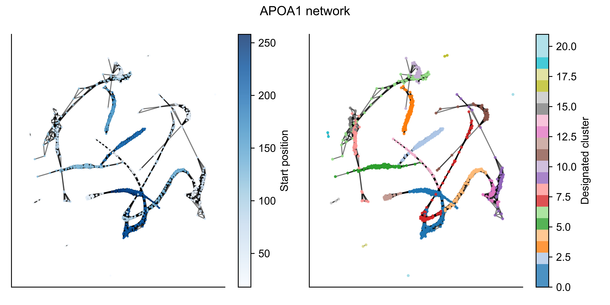
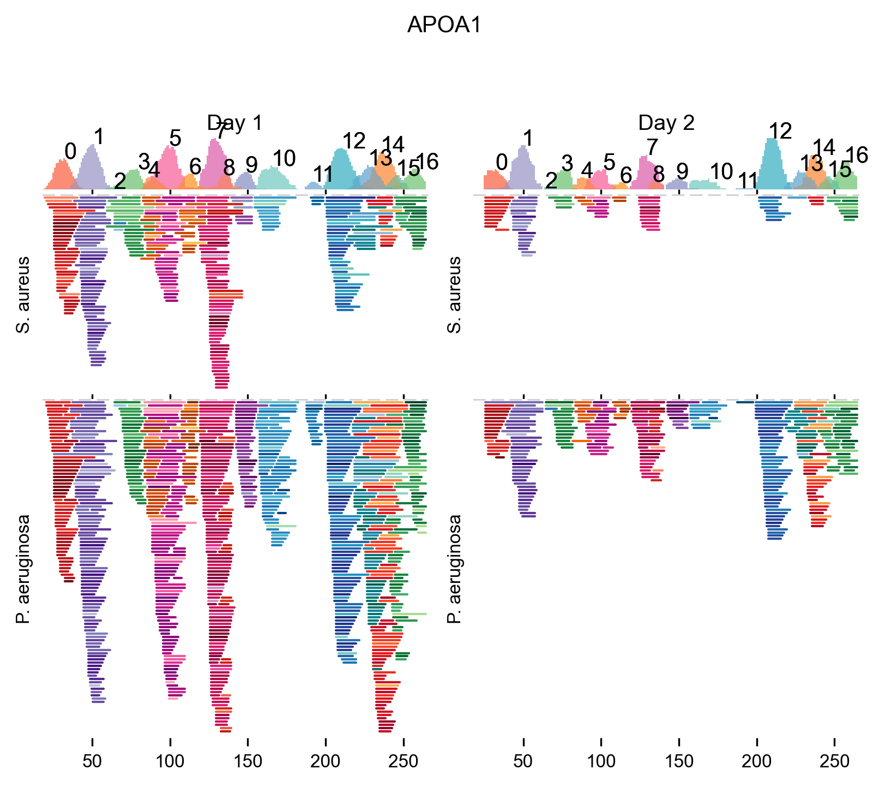
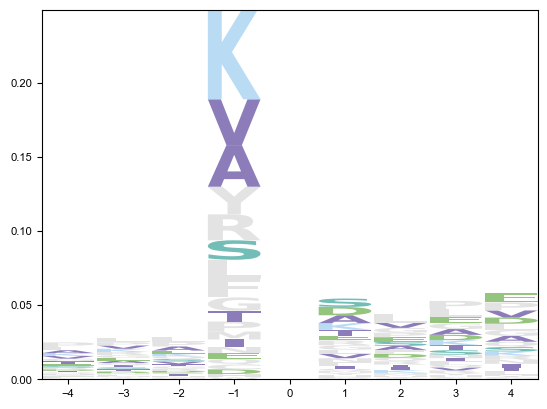

<p align="center">
    
<p>

# pepnets: clustering linear peptide sequences on protein backbones

This package clusters linear peptides that are degradation products of proteins based on their sequence. The package was created and used in a [study where we analyzed the wound fluids from infected wounds.](https://www.biorxiv.org/content/10.1101/2023.12.28.573527v1) The example data in the [notebook](notebooks/example.ipynb) and showcased [below](#usage) is from that study.

The package includes modules to perform the clustering and 3 modules for down-stream analysis and visualization:

- FeatureMatrix: generates a feature matrix which can be used for further analysis of clusters.
- PeptiGrams: Plots [peptigram-esque](http://bioware.ucd.ie/peptigram/) plots to visualize the peptidome from a protein.
- LogoPlot: Computes and plots the cut-site specificity. 


## install
To install the package, clone this repo:
```
> git clone https://github.com/ErikHartman/pepnets.git
```
and then pip install:
```
> pip install path_to_root
```

The software has been tested with python 3.9.6

## usage

```py
pnet = PeptideNetwork(
    datamatrix=datamatrix,
    protein_database=sus_scrofa,
)

pnet.get_clusters(resolution=0.8)
```
```py
pnet.plot_protein(protein="APOA1")
```

```py

fm = FeatureMatrix(datamatrix, pnet.clusters)
```
```py
design = pd.read_csv("../data/design.csv")
peptigram = PeptiGram(fm.datamatrix, design)
peptigram.plot_peptigram(
    "APOA1", groups=["S. aureus", "P. aeruginosa"], days=["Day 1"], size_factor=0.3,
)
```


```py
lp = LogoPlot(fm.datamatrix, design, sus_scrofa, topn)
height = lp.get_letter_heights(test_samples, background_samples)
fig, ax = plt.subplots(1,1)
lp.plot(height, ax=ax)
```



For more examples, see `notebooks`.

## dependencies
This package is heavily dependent on `networkx` for graph creation, `leidenalg` for community detection, and several packages for manipulation and plotting (`pandas, numpy, matplotlib, seaborn`).