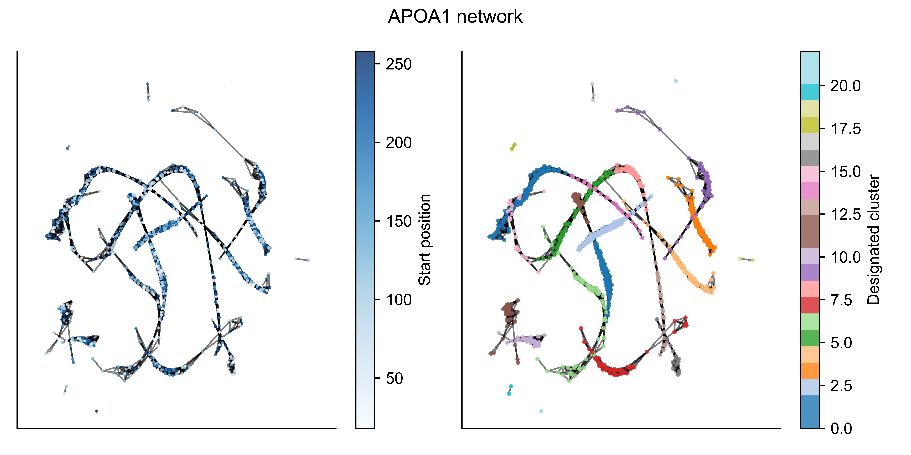
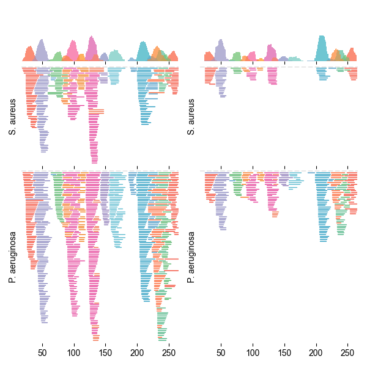
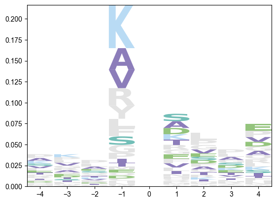

# Clustering linear peptide sequences on protein backbones

This package clusters linear peptides that are degradation products of proteins based on their sequence. The package was created and used in a [study where we analyzed the wound fluids from infected wounds.](https://www.biorxiv.org/content/10.1101/2023.12.28.573527v1) The example data in the [notebook](notebooks/example.ipynb) and showcased [below](#usage) is from that study.

The package includes modules to perform the clustering and 3 modules for down-stream analysis and visualization:

- FeatureMatrix: generates a feature matrix which can be used for further analysis of clusters in e.g. ML applications.
- PeptiGrams: Plots [peptigram-esque](http://bioware.ucd.ie/peptigram/) plots to visualize the peptidome from a protein.
- LogoPlot: Computes and plots the cut-site specificity. 

---
**NOTE**

This code could be optimized and tailored for different purposes in many ways. It is not meant to be an all-purpose package, but a package that showcases how the method presented in our study was implemented. Our hope is that it is directly useful to some, and that others gain inspiration from it for their specific application.

---

## analysis

The repo also contains code and data to recreate the majority of the figures from the [study](https://www.biorxiv.org/content/10.1101/2023.12.28.573527v1) in the `/notebook/recreate_figs/`- notebooks. The notebooks are seeded, but non-deterministic algorithms (e.g., Leiden) may still result in slight variations due to different processors. These variations do not impact any conclusions drawn in the paper.

To run the `/notebook/recreate_figs/`- notebooks, you need to install additional dependencies from the ones described below.


## install
To install the package, clone this repo:
```
> git clone https://github.com/ErikHartman/pepnets.git
```
and then pip install:
```
> pip install path_to_root
```

The software has been tested with python 3.9.6

## usage

```py
pnet = PeptideNetwork(
    datamatrix=datamatrix,
    protein_database=database_dict,
)
pnet.create_network(distance_cutoff=4)
pnet.get_clusters(resolution=0.8)
```
```py
pnet.plot_protein(protein="APOA1")
```

```py

fm = FeatureMatrix(datamatrix, pnet.clusters)
```
```py
design = pd.read_csv("../data/design.csv")
peptigram = PeptiGram(fm.datamatrix, design)
peptigram.plot_peptigram(
    "APOA1", groups=["S. aureus", "P. aeruginosa"], days=["Day 1"], size_factor=0.3,
)
```


```py
lp = LogoPlot(fm.dm, database_dict)

height = lp.get_letter_heights(test_samples, background_samples)
fig, ax = plt.subplots(1, 1)
lp.plot(height, ax=ax)
```



For more examples, see `notebooks`.

## dependencies
This package is heavily dependent on `networkx` for graph creation, `leidenalg` for community detection, and several packages for manipulation and plotting (`pandas, numpy, matplotlib, seaborn`).